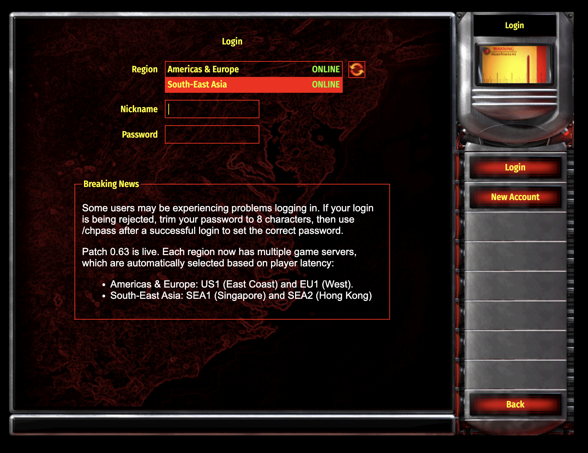
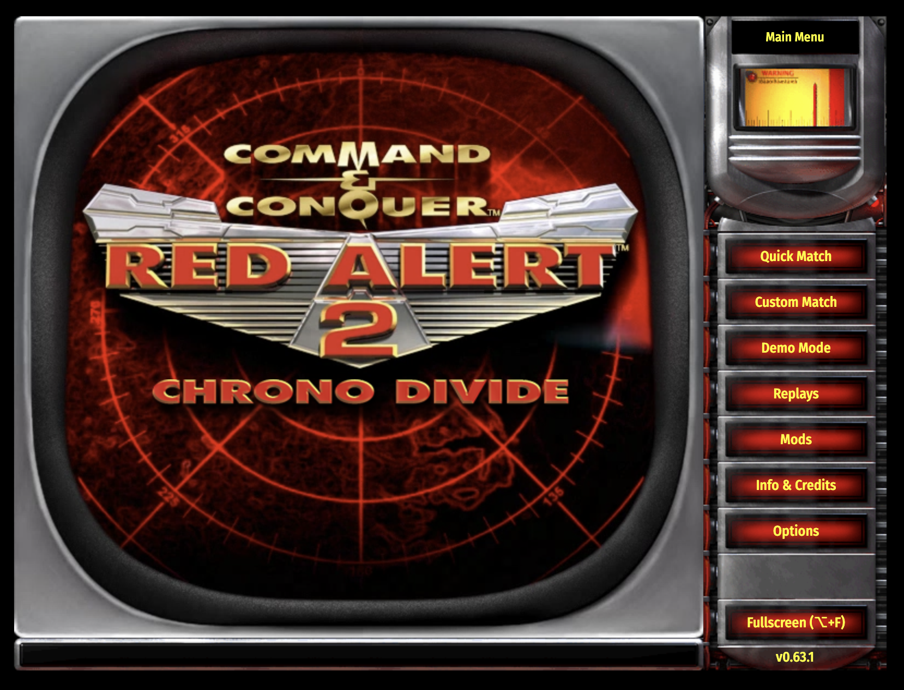

# RA2-Chronodivide-MacOS-Install

The RA2 ChronoDivide Installer is a customized app designed for smooth, lag-free gameplay across macOS platforms. Built with Electron.js, this installer leverages direct CPU and GPU access, providing superior performance over web-based play. It minimizes issues like stuttering, slowness, and lag, even with high object counts or large teams. With Webview integration, ChronoDivide runs seamlessly, offering the same fast and responsive experience across operating systems. Perfect for Red Alert 2 fans, this installer allows players to enjoy ChronoDivide without browser limitations or performance drops. Download and experience RA2 ChronoDivide optimized for your system!

## Install Red Alert 2 on MacOS

```
git clone https://github.com/fangda123/RA2-Chronodivide-MacOS-Install.git && cd RA2-Chronodivide-MacOS-Install && cat RA2\ MacOS\ DMG\!\!.zip.00* > RA2.zip && unzip RA2.zip && rm -f RA2\ MacOS\ DMG\!\!.zip.00* && rm -f RA2.zip && cd RA2\ MacOS\ DMG\!\! && open RA2.dmg
```


#### Move RA2 to Application Folder


#### Click Download


Wait loading !!


Play game


* [x] Enjoy

#### Thank you, ChronoDivide (https://chronodivide.com), for creating a community platform and developing a space where we can come together and have fun. Credit to ChronoDivide!`

